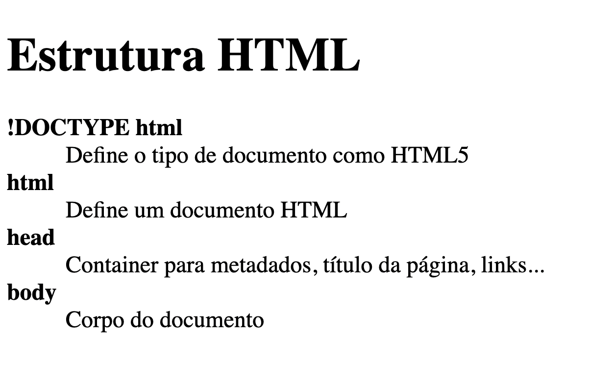

<h1 align="center"> HTML Básico de Glossário </h1>

Programa exclusivo e gratuito, promovido pela Rocketseat para ensino de tecnologias WEB.  

  <a href="#-tecnologias">Tecnologias</a>&nbsp;&nbsp;&nbsp;|&nbsp;&nbsp;&nbsp;
  <a href="#-projeto">Projeto</a>&nbsp;&nbsp;&nbsp;|&nbsp;&nbsp;&nbsp;
  <a href="#memo-licença">Licença</a>

  

 

  

## 🚀 Tecnologias

Esse projeto foi desenvolvido com a seguinte tecnologia:

- HTML 

## 💻 Projeto

O projeto foi desenvolvido para exemplificar um glossário básico, explicando o que seria o html, através do uso de um código simples de lista.

- [Assistir aulas Rocketseat](https://lp.rocketseat.com.br/devlinks/inscricao?utm_source=github&utm_medium=descricao&utm_campaign=capture-devlinks&utm_term=organic&utm_content=descricao-github-mayk-brito)

## :memo: Licença

Esse projeto está sob a licença MIT.
